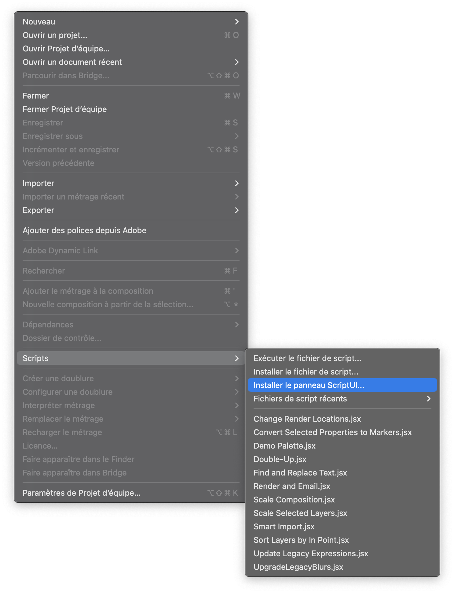

# Adobe-Team-Saver
Script pour sauvegarder les projets Teams Adobe localement.

1activerScripts.png
2activerScripts.png
3installScriptUI1.png
4scriptAdded.png
5selectScriptUI1.png
6window.png
7ui.png

# Installation After Effects

1. Télécharger le script `AEsaver.jsx` du répertoire Git

```bash
git clone --depth 1 https://github.com/ngarantBeauvoir/Adobe-Team-Saver.git
```


2. Ouvrir After Effects

3. Aller dans le menu `After Effects` > `Réglages` > `Modules de script et expressions`
---
<p align="center">
 
</p>


4. Dans la fenêtre qui s'ouvre, cocher la case `Autoriser les scripts à écrire des fichiers et à accéder au réseau` et `Activer le débogage JavaScript`
---
<p align="center">
    
</p>


5. Dans le menu `Fichier` > `Scripts` > `Installer le panneau ScriptUI`
---
<p align="center">
    
</p>


6. Dans la fenêtre Finder qui s'ouvre, choisir le script `AEsaver.jsx` et cliquer sur `Sélectionner`
---
<p align="center">
    
</p>

7. Une fenêtre de dialogue s'ouvre, cliquer sur `OK` puis redémarrer After Effects
---
<p align="center">
    
</p>

8. Une fois After Effects redémarré, dans le menu `Fenêtre` > `AEsaver.jsx`
---
<p align="center">
    
</p>

9. Commencer à sauvegarder vos projets!
---
<p align="center">
    
</p>

## Emplacement des fichiers de ScriptUI
```bash
cp AEsaver.jsx ~/Library/Preferences/Adobe/After\ Effects/24.5/Scripts/ScriptUI\ Panels/AEsaver.jsx
```
